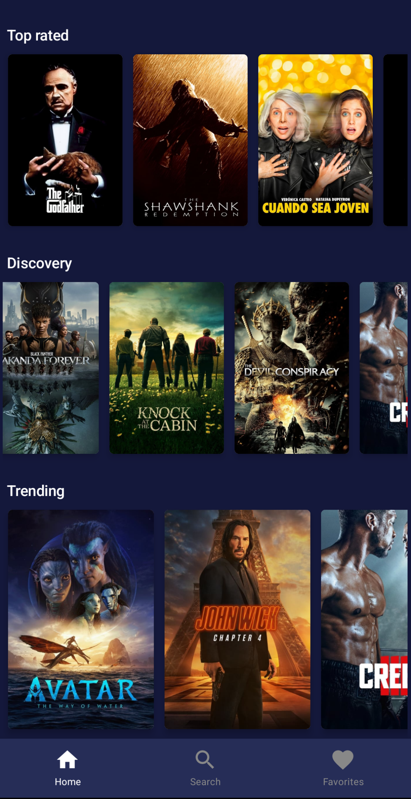
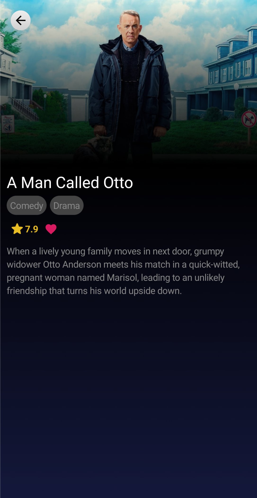

# MIRUS
A movies app

  

## Android Architecture Component

[Architecture](https://github.com/googlesamples/android-architecture-components)

[Kotlin](https://kotlinlang.org/)

[Lifecycle](https://developer.android.com/topic/libraries/architecture/lifecycle)

[View Model](https://developer.android.com/topic/libraries/architecture/viewmodel)

[Compose](https://developer.android.com/jetpack/compose)

## Libraries

- [Kotlin](https://kotlinlang.org/docs/reference/)

- [TMDB](https://www.themoviedb.org/documentation/api)

- [Coroutines](https://kotlinlang.org/docs/reference/coroutines.html)

- [Retrofit](https://github.com/square/retrofit)

- [Gson](https://github.com/google/gson)

- [Picasso](https://square.github.io/picasso/)

Add your TMDB key to local.properties before use :)
> tmdb\_api\_key = "YOUR_KEY"

