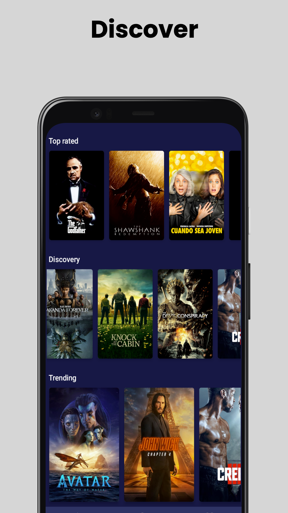
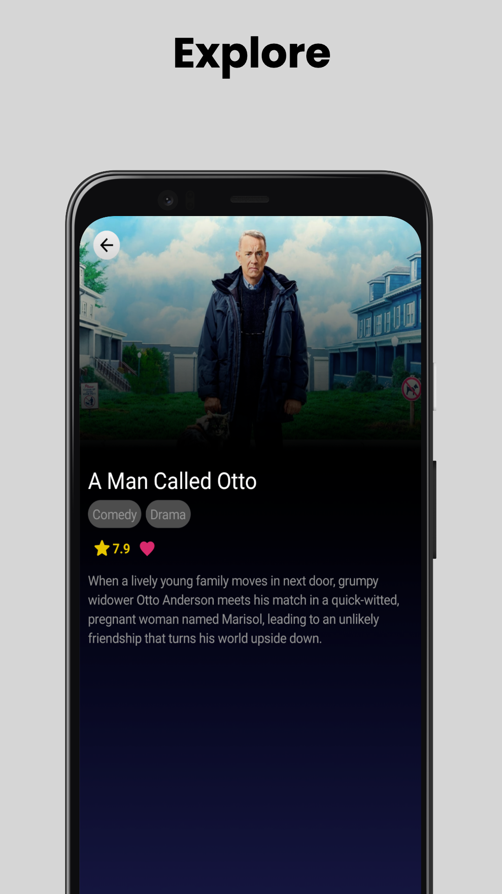
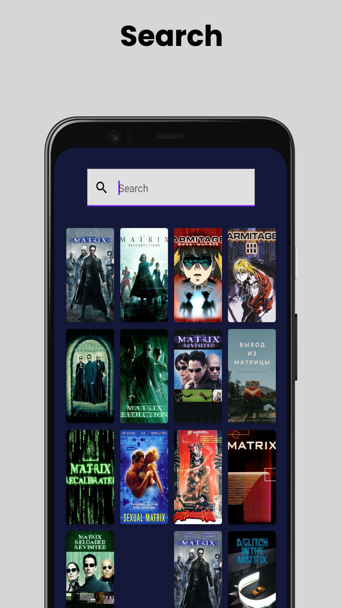
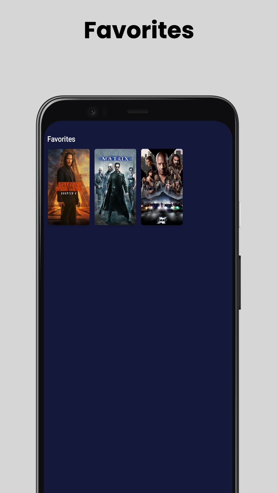

# MIRUS

Introducing Mirus, a feature-rich app that lets you explore and discover movies with ease. Built with clean code guidelines, Mirus is developed using Kotlin and follows the MVVM architecture pattern. With the power of Jetpack Compose, the app provides an intuitive user interface. Enjoy browsing through a vast collection of movies, accessing detailed information, and staying up-to-date with the latest releases. Mirus is designed to work seamlessly offline, allowing you to access your favorite movies even without an internet connection. Powered by Hilt for dependency injection and Coroutines for efficient asynchronous operations.

  
  
  
  

Screenshots made with https://screenshots.pro

## Android Architecture Component

[Architecture](https://developer.android.com/topic/architecture)

[Clean Architecture](https://blog.cleancoder.com/uncle-bob/2012/08/13/the-clean-architecture.html)

[Offline first](https://developer.android.com/topic/architecture/data-layer/offline-first])

[Kotlin](https://kotlinlang.org/)

[Jetpack Compose](https://developer.android.com/jetpack/compose)

[Jetpack View Model](https://developer.android.com/topic/libraries/architecture/viewmodel)

[Jetpack Lifecycle](https://developer.android.com/topic/libraries/architecture/lifecycle)

## Libraries

- [Hilt](https://developer.android.com/training/dependency-injection/hilt-android)

- [Coroutines](https://kotlinlang.org/docs/reference/coroutines.html)

- [Retrofit](https://github.com/square/retrofit)

- [Coil](https://github.com/google/gson)

- [TMDB](https://www.themoviedb.org/documentation/api)

Add your TMDB key to local.properties before use :)
> tmdb\_api\_key = "YOUR_KEY"

