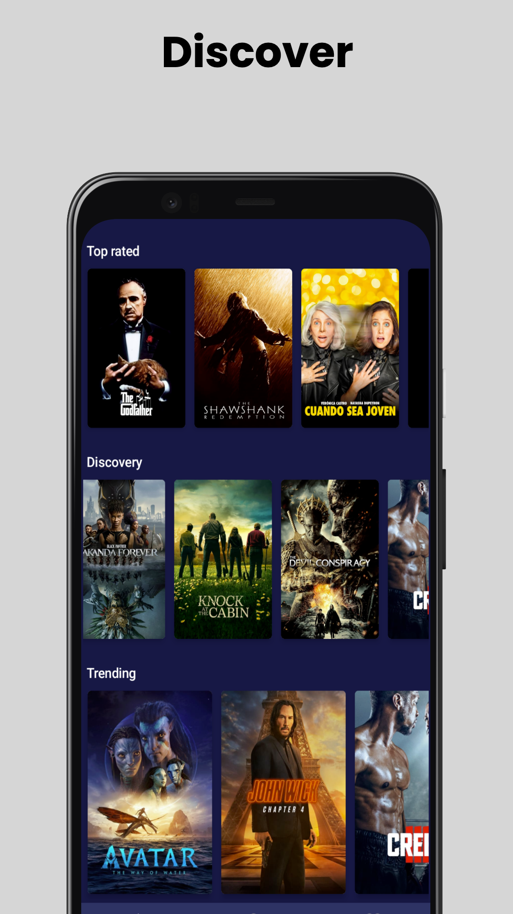
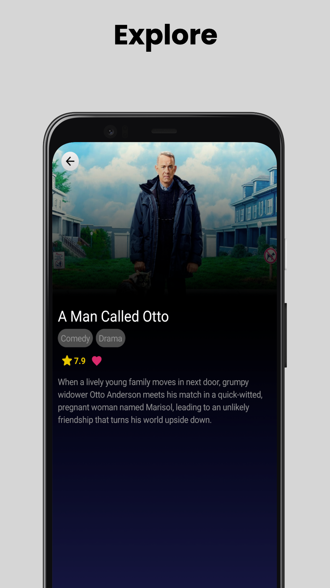
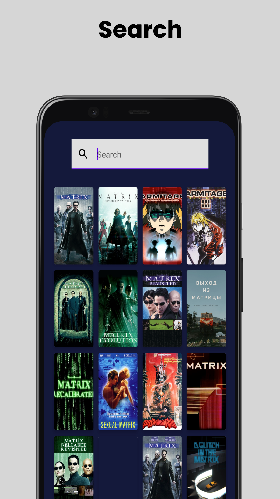
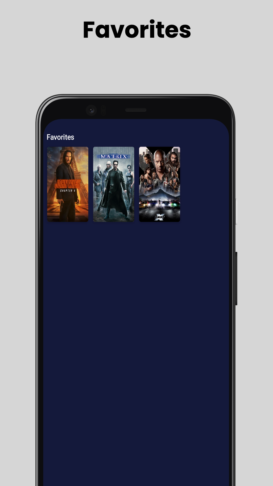

# MIRUS

Mirus is a modern Android movie discovery app built with **Kotlin** and **Jetpack Compose**. It uses a layered MVVM/Clean Architecture-style structure with **Hilt**, **Room**, **Retrofit**, and **Coroutines**, and now includes stronger offline behavior, smarter search flows, and background sync with **WorkManager**.

<p>
  
  
  
  
</p>

Screenshots made with https://screenshots.pro

## Features

- Discover, top rated, and trending movie feeds
- Movie detail screens with favorites support
- Offline-backed reads with Room caching
- Debounced search with recent searches
- Last updated + offline sync status in the movie list UI
- Background refresh scheduling with WorkManager
- Retry/backoff for transient sync failures
- Official Navigation Compose-based navigation
- Compose UI and Room instrumentation coverage

## Tech stack

- [Kotlin](https://kotlinlang.org/)
- [Jetpack Compose](https://developer.android.com/jetpack/compose)
- [Android ViewModel](https://developer.android.com/topic/libraries/architecture/viewmodel)
- [Coroutines / Flow](https://kotlinlang.org/docs/coroutines-overview.html)
- [Hilt](https://developer.android.com/training/dependency-injection/hilt-android)
- [Room](https://developer.android.com/training/data-storage/room)
- [Retrofit](https://github.com/square/retrofit)
- [OkHttp](https://square.github.io/okhttp/)
- [WorkManager](https://developer.android.com/topic/libraries/architecture/workmanager)
- [Coil](https://coil-kt.github.io/coil/)
- [TMDB API](https://www.themoviedb.org/documentation/api)

## Architecture notes

Mirus keeps a clear separation between:

- `data`
- `domain`
- `presentation`
- `ui`

It follows Android architecture guidance and an offline-first direction using Room-backed local data.

Helpful references:

- [Android Architecture](https://developer.android.com/topic/architecture)
- [Clean Architecture](https://blog.cleancoder.com/uncle-bob/2012/08/13/the-clean-architecture.html)
- [Offline first](https://developer.android.com/topic/architecture/data-layer/offline-first)

## Setup

Add your TMDB key to `local.properties` before running the app:

```properties
tmdb_api_key="YOUR_KEY"
```

## Build and test

```bash
./gradlew :app:compileDebugKotlin
./gradlew testDebugUnitTest
./gradlew connectedDebugAndroidTest
```

## Recent improvements

- Modernized Gradle / AGP / Kotlin toolchain
- Moved dependency versions into a version catalog
- Improved search flow with debounce and cancellation
- Reduced duplicate collectors in the detail flow
- Batched Room sync work more efficiently
- Added background sync scheduling via WorkManager
- Surfaced offline mode and last successful sync time in the UI
- Expanded UI and database test coverage
